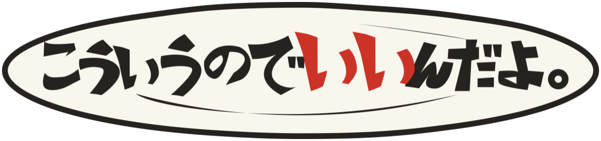
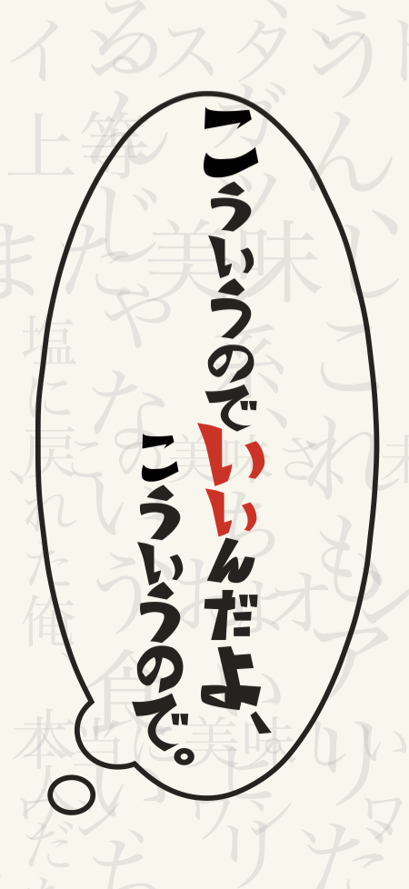
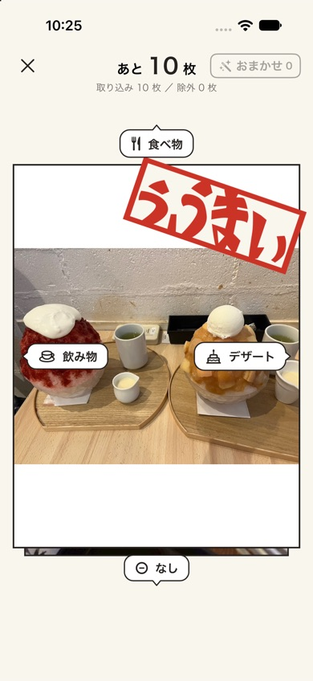
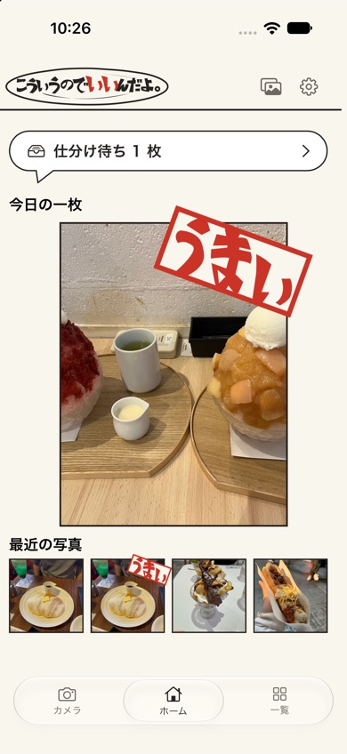
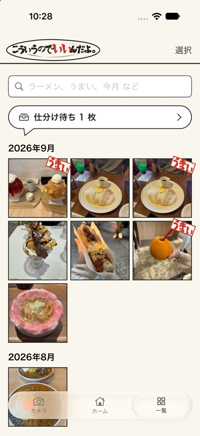
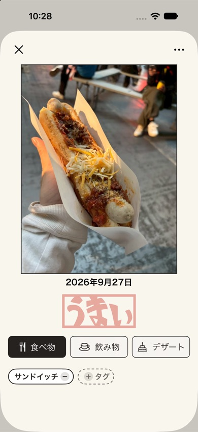
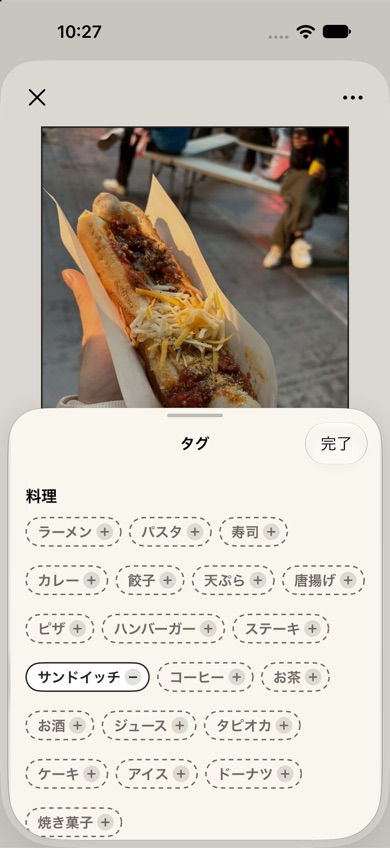
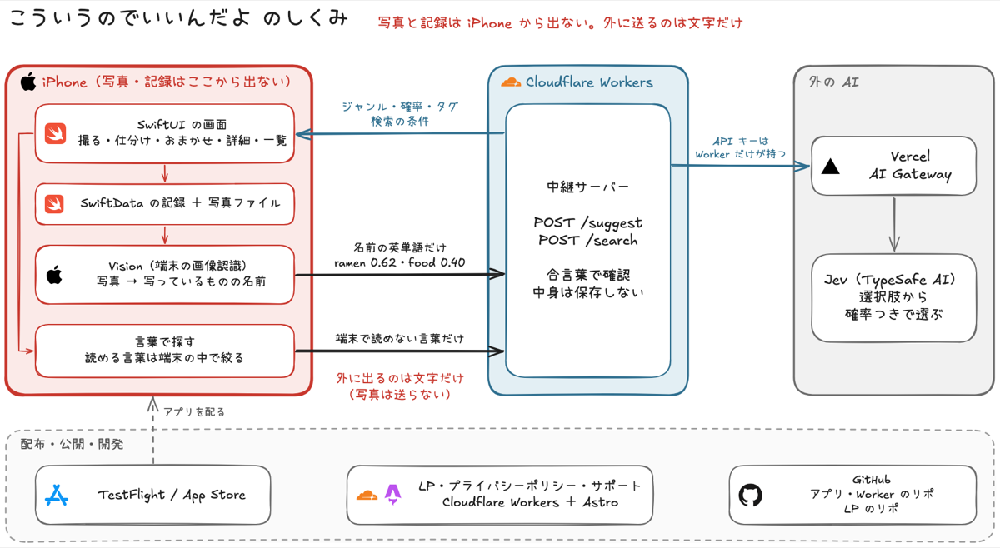

  

<h3 align="center">こういうのでいいんだよ、こういうので。</h3>

いつものご飯を気軽に撮って残せる、iPhone のご飯記録アプリ

<table>
  <tr>
    <td align="center"></td>
    <td align="center"></td>
    <td align="center"></td>
  </tr>
  <tr>
    <td align="center">起動画面</td>
    <td align="center">払って仕分け</td>
    <td align="center">ホーム</td>
  </tr>
  <tr>
    <td align="center"></td>
    <td align="center"></td>
    <td align="center"></td>
  </tr>
  <tr>
    <td align="center">一覧</td>
    <td align="center">記録の詳細</td>
    <td align="center">タグ</td>
  </tr>
</table>

## どんなアプリか

ごちそうは写真に残すのに、カップ麺や卵かけご飯のような「いつものご飯」は記録に残りにくいものです。

- そもそも写真を撮らない
- 撮っても、カメラロールの中で他の写真に埋もれる
- 食事記録アプリは、写真に加えて入力が必要で、続かない

そこで、記録に必要な操作をできるだけ減らしました。

**撮る → 保存される → 払って仕分ける（後回しでもよい）**

アプリを開くとすぐにカメラ。1 枚撮るだけで、日付とともに保存されます。ジャンルの仕分けは、写真を上下左右に払うだけ。あとからホームや一覧で見返して、「これ、おいしかったな」と思い出せます。

## できること

- **開いたらすぐ撮れる**：起動するとカメラが開き、食べる前にサッと 1 枚撮れる
- **払って仕分け**：上は「食べ物」、左は「飲み物」、右は「デザート」、下は「なし」。仕分けは後回しにしてもよい
- **「う、うまい」**：特においしかったご飯に、ハンコを押すようにお気に入りを付ける
- **アルバムから取り込む**：撮りためた写真をまとめて取り込み、食事でない写真は除く
- **AI の提案とおまかせ**：写っているものからジャンルとタグを提案し、自信のある写真は「おまかせ」でまとめて仕分ける
- **詳細でタグ**：記録の詳細で、ラーメン・カレー・コーヒーなどのタグを付け外しする
- **言葉で探す**：「今月のうまいラーメン」のような言葉で、一覧を絞り込む
- **まとめて消す**：一覧で何枚か選んで、まとめて消す

## 世界観

名前は、『孤独のグルメ』の「こういうのでいいんだよ、こういうので」から取りました。豪華な料理だけが「いいご飯」ではない。自分がおいしいと思えば、それでいい。

　

- **マンガのコマ**：写真を墨の線のコマ枠で囲み、いつものご飯を一コマのように見せる
- **ハンコ**：お気に入りは「う、うまい」「うまい」のハンコ（デザイナーが制作）
- **払ったときの手応え**：仕分けが決まる瞬間に、手元が震える

紙の色の地に墨の線、紅生姜のような赤をアクセントにしています。

## しくみ

写真と記録は iPhone から出ません。写真に写っているものは端末の中（Vision）で名前にし、外に送るのはその名前と検索の言葉、つまり文字だけです。中継サーバー（Cloudflare Workers）が AI に聞いて、ジャンル・タグ・検索の条件を返します。AI の API キーは中継サーバーだけが持ち、送られた中身は保存しません。

## 使った技術

| 部分 | 技術 |
|---|---|
| アプリ | Swift / SwiftUI / SwiftData / Vision |
| 中継サーバー | Cloudflare Workers（TypeScript） |
| AI | Vercel AI Gateway と Jev |
| LP | Astro（Cloudflare Workers） |

## リンク

- [LP](https://kouiunodeiindayo-lp.k-27.workers.dev/)
- [プライバシーポリシー](https://kouiunodeiindayo-lp.k-27.workers.dev/privacy/)
- [サポート](https://kouiunodeiindayo-lp.k-27.workers.dev/support/)

## チーム

チーム「家形」。エンジニア 2 人とデザイナー 1 人で作りました。

58ハッカソン2026 in 関西大学 提出作品。

## 開発する人へ

- 環境構築と、自分の iPhone で動かすまでの手順：[`docs/setup.md`](docs/setup.md)
- 何ができるアプリか：[`docs/requirements.md`](docs/requirements.md)、画面と操作：[`docs/screen-design.md`](docs/screen-design.md)
- データの形：[`docs/data-model.md`](docs/data-model.md)、フォルダ構成とコードの境界：[`docs/architecture.md`](docs/architecture.md)、技術的な決定と理由：[`docs/adr/`](docs/adr/)
- AI と一緒に開発するときのルールの正本：[`AGENTS.md`](AGENTS.md)（Claude Code・Codex・Antigravity のどれでも同じルールが読み込まれる）
